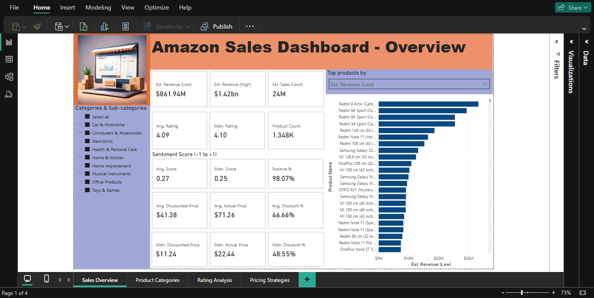

# amazon-sales-dashboard
Amazon Sales Dashboard: Power BI Visualisation on Amazon Sales Data

## Contents
1. [Overview](#1-overview)
2. [Repository](#2-repository)
3. [Data Cleaning and Preprocessing](#3-data-cleaning-and-preprocessing)
4. [Deployment](#4-deployment)
5. [Key Insights Visualised](#5-key-insights-visualised)
6. [Methodology and Assumptions](#6-methodology-and-assumptions)
7. [Data Analysis](#7-data-analysis)
8. [Tools Used](#8-tools-used)
9. [Acknowledgement](#9-acknowledgement)
10. [License](#10-license)

## 1. Overview

This project contains the Power BI visualisations for analysing the [Amazon Sales Dataset](https://www.kaggle.com/datasets/karkavelrajaj/amazon-sales-dataset) sourced from Kaggle. The dataset consists of over 1,000+ products scraped from Amazon India in January 2023, including details on product categories, ratings, prices, and reviews.

The goal of this project is to provide insights into sales estimates, revenue projections, pricing strategies, and category performance using interactive Power BI dashboards.

Data cleaning and preprocessing were performed in Jupyter Notebook, and visualisation was performed on Power BI.

## 2. Repository

This repository contains: 
- [`data/`](data/): folder containing the original csv file `data/amazon.csv`, and the processed csv file `data/amazon_etl.csv`
- [`amazon_etl.ipynb`](amazon_etl.ipynb): Jupyter Notebook for data cleaning and preprocessing  
- `amazon_sales_dashboard.pbix`: Power BI Dashboard (PBIX file)
- [`README.md`](README.md)

## 3. Data Cleaning and Preprocessing

**Original Dataset**

The original [dataset](https://www.kaggle.com/datasets/karkavelrajaj/amazon-sales-dataset) contained the following columns:
- `product_id`: product ID
- `product_name`: name of the product
- `category`: category of the product
- `discounted_price`: discounted price of the product
- `actual_price`: actual price of the product
- `discount_percentage`: percentage of discount for the product
- `rating`: rating of the product
- `rating_count`: number of people who voted for the Amazon rating
- `about_product`: description about the product
- `user_id`: ID of the user who wrote review for the product
- `user_name`: name of the user who wrote review for the product
- `review_id`: ID of the user review
- `review_title`: short review
- `review_content`: long review
- `img_link`: image link of the product
- `product_link`: official website link of the product

The dataset required minor cleaning and feature engineering to optimise it for visualisation. Below are the key steps taken:

A. Handling Missing Data
- Less than 2% of rows contained missing values → Removed using **df.dropna()**

B. Duplicate Removal
- Identical records (based on `product_id`) were removed.

C. Column Selection
- Dropped non-essential columns: `about_product`,` user_id`, `user_name`, `review_id`, `img_link`, `product_link`
- These contained valuable information but were excluded for simplicity in the visualisation.

D. Recalculating Discount Percentage
- `discount_percentage` was dropped.
- Instead, it was recalculated directly in Power BI as a calculated column.

E. Category Refinement

The category column was split into:
- Main category
- First sub-category (for better drill-down analysis in Power BI)

F. Currency Standardisation
- Prices were converted to **USD ($)** as it is the most globally recognised and referenced currency.

G. Sentiment Analysis
- Sentiment score was derived from review_content using **TextBlob**.
- Each review was categorised as **Positive**, **Neutral**, or **Negative**.
- `review_title` and `review_content` were dropped after sentiment calculation.
- Dropped columns contained useful details but were removed to streamline the dataset for visualisation and performance in Power BI.

## 4. Deployment

**Jupyter Notebook (Data Preprocessing)**

The follow Python Libraries need to be installed to run the notebook:
- **kagglehub**: to access Kaggle resources
- **pandas**: data analysis library
- **TextBlob**: textual data processing

**Power BI (Data Visualisation)**
1. Clone this repository.
2. Download and install the latest version of Power BI Desktop from [Microsoft’s official site](https://powerbi.microsoft.com/). Please note that Power BI only runs in several software platforms.
3. Launch Power BI and open the file `amazon_sales_dashboard.pbix`.
4. By default, the source CSV file is expected at: `C:\amazon-sales-dashboard\data\amazon_etl.csv` (Windows)
5. If the CSV file is stored in a different location, update the source path.
- Navigate to File → Options and Settings → Data Source Settings.
- Click **Change Source** and select the correct CSV file location.
- Click **Apply Changes**.

## 5. Key Insights Visualised

**Power BI Dashboards**
- Page 1: **Overview** (High-level summary of sales, revenue, and key metrics)
- Page 2: **Category and Sub-category Performance**
- Page 3: **Rating Analysis**
- Page 4: **Pricing Strategy**

A. Overall Sales and Revenue Estimates
- (minimum) estimated sales count: based on rating count as a proxy for sales
- estimated revenue: using both discounted and actual prices
- product count: total unique products analysed

B. Category and Sub-category Performance
- sales and revenue comparison across product categories
- price and discount analysis (average, median values)
- sentiment analysis (sentiment score, percentage of positive scores)

C, Rating and Sentiment Analysis
- distribution of ratings
- relationship between ratings and sentiment scores
- correlation between ratings and prices (discounted and actual)

D. Pricing Strategy Insights
- price distribution (discounted vs. actual price)
- discount percentage analysis
- impact of pricing on estimated sales

## 6. Methodology and Assumptions

A. Handling Sales Estimates

Since actual sales data isn’t available, we use **rating count** as a proxy for minimum sales.
- (minimum) estimated sales count = rating count
- estimated revenue = rating count * price (both discounted and actual)

Note: The actual number of units sold may be higher, as not all customers leave ratings or reviews, and returns or refunds are not captured in the dataset. We present revenue calculations based on both discounted and actual prices to reflect potential variability in purchase price.

B. Price Considerations for Rating Correlation
- primary metric: discounted price (most recent listed price)
- comparison metric: actual price (for understanding discount impact)

Note: Buyer purchase price may have varied due to discounts or promotions.

C. Key Terms and Labels Used

To ensure clarity and transparency, we use:
- **estimated sales count** instead of **sales count**
- **estimated revenue** instead of **revenue**

## 7. Data Analysis

The Power BI visualisations provide Amazon sellers and analysts with tools to explore and compare sales trends, pricing strategies, and product performance. The dashboards present correlations, distributions, and key metrics through interactive graphs and scatter plots.

Note: This visualisation project does not perform explicit analysis or interpretation but serves as a tool to support further insights and decision-making.

Key Questions the Visualisations Help Explore:

1. What are the characteristics of top-selling products?
- Identify products with the highest estimated sales (based on rating count).
- Examine how pricing, discounts, and ratings relate to top-performing products.

2. Which product categories and sub-categories perform best?
- Compare estimated sales and revenue across different product categories.
- Observe trends in pricing, discounts, and customer ratings for each category.

3. How do product ratings influence sales and pricing, and conversely, how do sales volume and pricing impact product ratings?
- Explore relationships between ratings, pricing, and estimated sales.
- Understand whether highly-rated products tend to sell more or have premium pricing.

4. What are the optimal pricing strategies?
- Visualise price distributions and discount percentages across products.
- Assess whether higher discounts correlate with higher estimated sales.

These visualisations enable Amazon sellers, marketers, and analysts to uncover patterns and trends, forming the basis for deeper analysis and strategic decision-making.

Next Steps:
- Improve sales estimation models by integrating review-to-purchase ratios.
- Expand analysis to include seasonal trends and discounting impact.
- Automate data updates for real-time tracking.

## 8. Tools Used

- **Jupyter Notebook**: data cleaning and preprocessing
- **Power BI**: data visualisation and dashboard creation

## 9. Acknowledgement

- This project was developed using the **free tier** of **Power BI Desktop**, so there were some limitations in terms of data storage, integration options, and collaboration features.
- Dataset sourced from [Kaggle: Amazon Sales Dataset](https://www.kaggle.com/datasets/karkavelrajaj/amazon-sales-dataset).
- The logo used in this project was created using Apple’s Image Playground app.

## 10. License

This project is developed and maintained by [Bernard Tse](https://github.com/bernardtse). It is licensed under the MIT License. See the [LICENSE](LICENSE) file for more details.